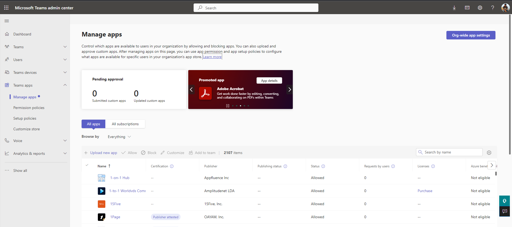

# Katonic Teams Chat Bot

## Prerequisites

- [Node.js](https://nodejs.org/), supported versions: 16, 18
- An Microsoft 365 Account
- [TeamsFx CLI](https://aka.ms/teamsfx-cli)

## Code changes required

Modify the file `appPackage/manifest.json` with the required changes for the application meta

## Deploy to Azure

Clone this Repository
```
git clone repo_url
cd bot-integrations/
```

Install NodeJS Packages
```
npm install
```

Login to Azure for Deployment
```
teamsfx account login azure
```

Edit the ENV file at `env\.env.Prod` and replace the variables below:
- AZURE_SUBSCRIPTION_ID : Insert your Azure Subscription ID here
- AZURE_RESOURCE_GROUP_NAME : Insert the Azure Resource Group name that you would like to use
- RESOURCE_SUFFIX : A random variable for globally unique name

Provision Resources on Azure
```
teamsfx provision --env prod
```

Deploy Chat Bot to Applications Page
```
teamsfx deploy --env prod
```

## Publishing the Chat Bot

Once Chat Bot is deployed, Go to : [Teams Admin Dashboard](https://admin.teams.microsoft.com/dashboard)

NOTE: Teams Admin Dashboard is only available to Administrators

In the Admin Panel go to `Teams app -> Manage apps`



Under Pending Approval, You can Approve (Publish) your Chat Bot for deployment to Teams.
